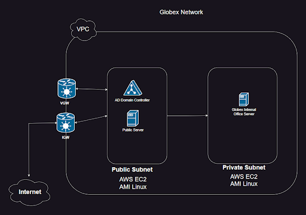
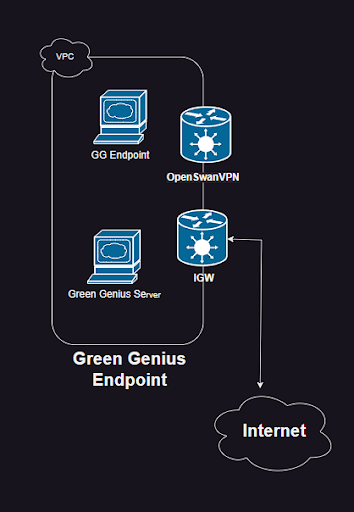
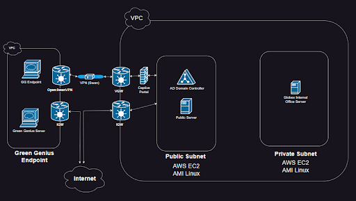

# Welcome to our Presentations repository

 This repository contains links and resources to our Final Project Presentation. This project is the culmination to our Ops-301 course utilizing problem framing, scripting techniques, systems administration and network engineering skills. Upon creation or as they are otherwise available, all final versions of our presentation will be found here.

 

## [Project Presentation PDF](./assets/pdf/)

## [Project Presentation- Final Video]()

 

## Network Topology

<!--  -->

 

### GlobeX Network Topology

 

### Green Genius Network Topology

 

### Full Network Topology

